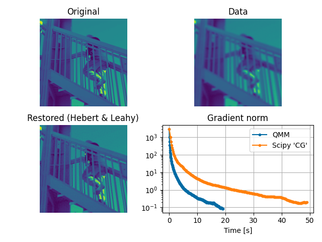

Q-MM: A Python toolbox for Quadratic Majorization-Minimization
==============================================================

[](https://doi.org/10.5281/zenodo.6373070)


[](https://qmm.readthedocs.io/en/latest/?badge=latest)


Q-MM is a Python implementation of Majorize-Minimize Quadratic
optimization algorithms. Algorithms provided here come from

    [1] C. Labat and J. Idier, “Convergence of Conjugate Gradient Methods with a
    Closed-Form Stepsize Formula,” J Optim Theory Appl, p. 18, 2008.

and

    [2] E. Chouzenoux, J. Idier, and S. Moussaoui, “A Majorize–Minimize Strategy
    for Subspace Optimization Applied to Image Restoration,” IEEE Trans. on
    Image Process., vol. 20, no. 6, pp. 1517–1528, Jun. 2011, doi:
    10.1109/TIP.2010.2103083.

See [documentation](https://qmm.readthedocs.io/en/stable/index.html) for more
background. If you use this code, please cite the references above and a
citation of this toolbox will also be appreciated, see [below](#citation). You
can also click ⭐ on the repo.

Quadratic Majorize-Minimize
---------------------------

The Q-MM optimization algorithms compute the minimizer of objective
function like

J(x) = ∑ₖ μₖ ψₖ(Vₖ·x - ωₖ)

where x is the unknown vector, Vₖ a linear operator, ωₖ a fixed data, μₖ
a scalar, ψₖ(u) = ∑ᵢφₖ(uᵢ), and φₖ a function that must be
differentiable, even, coercive, φ(√·) concave, and 0 \< φ\'(u) / u \<
+∞.

The optimization is done thanks to quadratic sugorate function. In
particular, no linesearch or sub-iteration is necessary, and close form
formula for the step are used with guaranteed convergence.

A classical example, like in the figure below that show an image
deconvolution problem, is the resolution of an inverse problem with the
minimization of

J(x) = \|\|² + μ ψ(V·x)

where H is a low-pass forward model, V a regularization operator that
approximate gradient (kind of high-pass filter) and ψ an edge preserving
function like Huber. The above objective is obtained with k ∈ {1, 2},
ψ₁(·) = \|\|², V₁ = H, ω₁ = y, and ω₂ = 0.



Features
--------

-   The `mmmg`, Majorize-Minimize Memory Gradient algorithm. See
    documentation and \[2\] for details.
-   The `mmcg`, Majorize-Minimize Conjugate Gradient algorithm. See
    documentation and \[1\] for details.
-   **No linesearch**: the step is obtained from a close form formula
    without sub-iteration.
-   **No conjugacy choice**: a conjugacy strategy is not necessary
    thanks to the subspace nature of the algorithms. The `mmcg`
    algorithm use a Polak-Ribière formula.
-   Generic and flexible: there is no restriction on the number of
    regularizer, their type, ..., as well as for data adequacy.
-   Provided base class for objectives and losses allowing easy and fast
    implementation.
-   Just one file if you like quick and dirty installation, but
    available with `pip`.
-   Comes with examples of implemented linear operator.

Installation and documentation
------------------------------

Q-MM is essentially just one file `qmm.py`. We recommend using poetry
for installation

``` {.sourceCode .sh}
poetry add qmm
```

The package can also be installed with pip. More options are described
in the [documentation](https://qmm.readthedocs.io/en/stable/index.html).

Q-MM only depends on `numpy` and Python 3.6.

Example
-------

The `demo.py` presents an example on image deconvolution. The first step
is to implement the operators `V` and the adjoint `Vᵀ` as callable
(function or methods). The user is in charge of these operators and
these callable must accept a unique Numpy array `x` and a unique return
value
([partial](https://docs.python.org/fr/3.9/library/functools.html#functools.partial)
in the `functools` module in the standard library is usefull here).
There is no constraints on the shape, everything is vectorized
internally.

After import of `qmm`, user must instantiate `Potential` objects that
implement `φ` and `Objective` objects that implement `μ ψ(V·x - ω)`

``` {.sourceCode .python}
import qmm
phi = qmm.Huber(delta=10)  # φ

data_adeq = qmm.QuadObjective(H, Ht, HtH, data=data)  # ||y - H·x||²
prior = qmm.Objective(V, Vt, phi, hyper=0.01)  # μ ψ(V·x) = μ ∑ᵢ φ(vᵢᵗ·x)
```

Then you can run the algorithm

``` {.sourceCode .python}
res = qmm.mmmg([data_adeq, prior], init, max_iter=200)
```

where `[data_adeq, prior]`{.sourceCode} means that the two objective
functions are summed. For more details, see
[documentation](https://qmm.readthedocs.io/en/stable/index.html).

Contribute
----------

-   Source code: <https://github.com/forieux/qmm>
-   Issue tracker: <https://github.com/forieux/qmm/issues>

Author
------

If you are having issues, please let us know

orieux AT l2s.centralesupelec.fr

More information about me [here](https://pro.orieux.fr). F. Orieux and
R. Abirizk are affiliated to the Signal and Systems Laboratory
[L2S](https://l2s.centralesupelec.fr/).

Citation
--------

Q-MM has a DOI with Zenodo
[](https://doi.org/10.5281/zenodo.6373069).
Specific version can also be cited. Citation can be

    François Orieux, & Ralph Abirizk. (2022). Q-MM: The Quadratic Majorize-Minimize Python toolbox (v0.12.0). Zenodo. https://doi.org/10.5281/zenodo.6373070

A example of bibtex is

    @software{francois_orieux_2022_6373070,
      author       = {François Orieux and Ralph Abirizk},
      title = {Q-MM: The Quadratic Majorize-Minimize Python toolbox},
      month        = mar,
      year         = 2022,
      publisher    = {Zenodo},
      version      = {0.12.0},
      doi          = {10.5281/zenodo.6373069},
      url          = {https://doi.org/10.5281/zenodo.6373069}
    }

Acknowledgement
---------------

Author would like to thanks [J.
Idier](https://pagespersowp.ls2n.fr/jeromeidier/en/jerome-idier-3/), [S.
Moussaoui](https://scholar.google.fr/citations?user=Vkr8yxkAAAAJ&hl=fr)
and [É. Chouzenoux](http://www-syscom.univ-mlv.fr/~chouzeno/). É.
Chouzenoux has also a Matlab package that implements 3MG for image
deconvolution that can be found on her
[webpage](http://www-syscom.univ-mlv.fr/~chouzeno/Logiciel.html).

License
-------

The project is licensed under the GPLv3 license.
