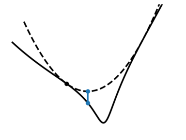
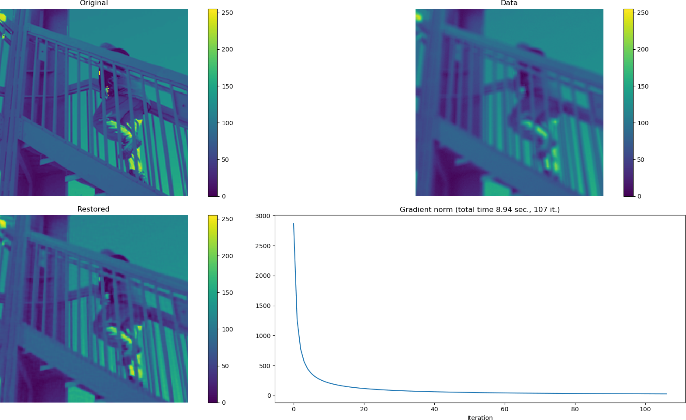

Q-MM: A Python toolbox for Quadratic Majorization-Minimization
==============================================================

Q-MM is a Python implementation of Majorize-Minimize Quadratic optimization
algorithms. Algorithms provided here come from

::

    [1] C. Labat and J. Idier, “Convergence of Conjugate Gradient Methods with a
    Closed-Form Stepsize Formula,” J Optim Theory Appl, p. 18, 2008.

and

::

    [2] E. Chouzenoux, J. Idier, and S. Moussaoui, “A Majorize–Minimize Strategy
    for Subspace Optimization Applied to Image Restoration,” IEEE Trans. on
    Image Process., vol. 20, no. 6, pp. 1517–1528, Jun. 2011, doi:
    10.1109/TIP.2010.2103083.

See `documentation <https://qmm.readthedocs.io/en/stable/index.html>`_ for more
background. If you use this code, please cite the references above and a
citation of this toolbox will also be appreciated. You can also click ⭐ on the
repo.

::

    @software{qmm,
       title = {Q-MM: The Quadratic Majorize-Minimize Python toolbox},
       author = {Orieux, Fran\c{c}ois and Abirizk, Ralph},
       url = {https://github.com/forieux/qmm},
    }

Quadratic Majorize-Minimize
---------------------------

The Q-MM optimization algorithms compute the minimizer of objective function
like

J(x) = ∑ₖ μₖ ψₖ(Vₖ·x - ωₖ)

where x is the unknown vector, Vₖ a linear operator, ωₖ a fixed data, μₖ a
scalar, ψₖ(u) = ∑ᵢφₖ(uᵢ), and φₖ a function that must be differentiable, even,
coercive, φ(√·) concave, and 0 < φ'(u) / u < +∞.

The optimization is done thanks to quadratic sugorate function. In particular,
no linesearch or sub-iteration is necessary, and close form formula for the step
are used with guaranteed convergence.

A classical example, like in the figure below that show an image deconvolution
problem, is the resolution of an inverse problem with the minimization of

J(x) = ||y - H·x||² + μ ψ(V·x)

where H is a low-pass forward model, V a regularization operator that
approximate gradient (kind of high-pass filter) and ψ an edge preserving
function like Huber. The above objective is obtained with k ∈ {1, 2}, ψ₁(·) =
||·||², V₁ = H, ω₁ = y, and ω₂ = 0.

Features
--------

- The ``mmmg``, Majorize-Minimize Memory Gradient algorithm. See documentation
  and [2] for details.
- The ``mmcg``, Majorize-Minimize Conjugate Gradient algorithm. See
  documentation and [1] for details.
- **No linesearch**: the step is obtained from a close form formula without
  sub-iteration.
- **No conjugacy choice**: a conjugacy strategy is not necessary thanks to the
  subspace nature of the algorithms. The ``mmcg`` algorithm use a Polak-Ribière
  formula.
- Generic and flexible: there is no restriction on the number of regularizer,
  their type, …, as well as for data adequacy.
- Provided base class for objectives and losses allowing easy and fast
  implementation.
- Just one file if you like quick and dirty installation, but available with
  ``pip``.
- Comes with examples of implemented linear operator.

Installation and documentation
------------------------------

Q-MM is essentially just one file ``qmm.py``. We recommend using poetry for
installation

.. code-block:: sh

   poetry add qmm

The package can also be installed with pip. More options are described in the
`documentation <https://qmm.readthedocs.io/en/stable/index.html>`_.

Q-MM only depends on ``numpy`` and Python 3.6.

Example
-------

The ``demo.py`` presents an example on image deconvolution. The first step is to
implement the operators ``V`` and the adjoint ``Vᵀ`` as callable (function or
methods). The user is in charge of these operators and these callable must
accept a unique Numpy array ``x`` and a unique return value (`partial
<https://docs.python.org/fr/3.9/library/functools.html#functools.partial>`_ in
the ``functools`` module in the standard library is usefull here). There is no
constraints on the shape, everything is vectorized internally.

After import of ``qmm``, user must instantiate ``Potential`` objects that
implement ``φ`` and ``Objective`` objects that implement ``μ ψ(V·x - ω)``

.. code:: python

   import qmm
   phi = qmm.Huber(delta=10)  # φ

   data_adeq = qmm.QuadObjective(H, Ht, HtH, data=data)  # ||y - H·x||²
   prior = qmm.Objective(V, Vt, phi, hyper=0.01)  # μ ψ(V·x) = μ ∑ᵢ φ(vᵢᵗ·x)
   
Then you can run the algorithm

.. code:: python

   res = qmm.mmmg([data_adeq, prior], init, max_iter=200)

where :code:`[data_adeq, prior]` means that the two objective functions are
summed. For more details, see `documentation
<https://qmm.readthedocs.io/en/stable/index.html>`_.

Contribute
----------

- Source code: `<https://github.com/forieux/qmm>`_
- Issue tracker: `<https://github.com/forieux/qmm/issues>`_

Author
------

If you are having issues, please let us know

orieux AT l2s.centralesupelec.fr

More information about me `here <https://pro.orieux.fr>`_. F. Orieux and R.
Abirizk are affiliated to the Signal and Systems Laboratory `L2S
<https://l2s.centralesupelec.fr/>`_.

Acknowledgement
---------------

Author would like to thanks `J. Idier
<https://pagespersowp.ls2n.fr/jeromeidier/en/jerome-idier-3/>`_, `S. Moussaoui
<https://scholar.google.fr/citations?user=Vkr8yxkAAAAJ&hl=fr>`_ and `É.
Chouzenoux <http://www-syscom.univ-mlv.fr/~chouzeno/>`_. É. Chouzenoux has also
a Matlab package that implements 3MG for image deconvolution that can be found
on her `webpage <http://www-syscom.univ-mlv.fr/~chouzeno/Logiciel.html>`_.

License
-------

The project is licensed under the GPLv3 license.
