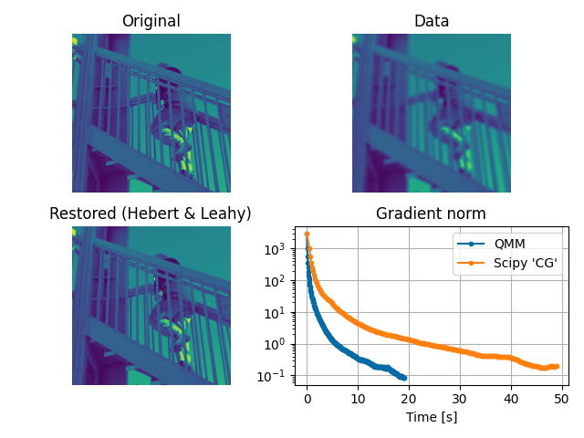

MM-Q
====

MM-Q is a Python implementation of Majorize-Minimize Quadratic optimization
algorithms. Algorithms provided here come from that research:

.. [1] C. Labat and J. Idier, “Convergence of Conjugate Gradient Methods with a
   Closed-Form Stepsize Formula,” J Optim Theory Appl, p. 18, 2008.

.. [2] E. Chouzenoux, J. Idier, and S. Moussaoui, “A Majorize–Minimize Strategy
   for Subspace Optimization Applied to Image Restoration,” IEEE Trans. on
   Image Process., vol. 20, no. 6, pp. 1517–1528, Jun. 2011, doi:
   10.1109/TIP.2010.2103083.

If you use this code, please cite the references above. A citation of this
library will also be appreciated.

::

   @software{forieuxmmq,
      title = {MM-Q},
      author = {Orieux, Fran\c{c}ois},
      url = {https://github.com/forieux/mmq},
   }

Majorize-Minimize Quadratic
---------------------------

The MM-Q optimization algorithms allow finding the minimum of criteria like

``J(x) = ∑ᵢ μₖ ψₖ(Vₖ·x - ωₖ)``

where ``x`` is the unknown vector, ``Vₖ`` a linear operator, ``ωₖ`` a fixed
vector, ``μₖ`` a scalar, ``ψₖ(u) = ∑ᵢφₖ(uᵢ)``, and ``φₖ`` a function that must
be differentiable, even, coercive, ``φ(√(·))`` concave, and ``0 < φ'(u) / u <
+∞``.

The optimization is done thanks to quadratic sugorate function. In particular,
no linesearch is necessary and close form formula are used with guaranted
convergence.

A classical example, like in the figure below that show an image deconvolution
problem, is the resolution of an inverse problem with the minimization of

``J(x) = ∥y - H·x∥² + μ ψ(V·x)``

where ``H`` is a low-pass forward model, ``V`` a regularization operator that
approximate gradient (kind of high-pass filter) and ``ψ`` an edge preserving
function like Huber. The above criterion is obtained with ``i ∈ {1, 2}``,
``ψ₁(·) = ∥·∥²``, ``V₁ = H``, ``ω₁ = y``, and ``ω₂ = 0``.

Features
--------

- The ``mmmg``, Majorize-Minimize Memory Gradient algorithm. See documentation
  for details.
- The ``mmcg``, Majorize-Minimize Conjugate Gradient algorithm. See
  documentation for details.
- **No linesearch**: the step is obtained from a close form formula.
- **No conjugacy choice**: a conjugacy strategy is not necessary thanks to the
  subspace nature of the algorithms. In case of ``mmcg``, the algorithm use a
  Polak-Ribière formula.
- Generic and flexible: there is no restriction on the number of regularizer,
  their type, ..., as well as for data adequacy.
- Provided base class for criterion allowing easier and fast implementation.

  implemented.
- Comes with examples of implemented linear operator.

Example
-------

The ``demo.py`` presents an example on image deconvolution. The first step is to
implement the operators ``V`` and the adjoint ``Vᵗ`` as callable (function or
methods). The user is in charge of these operators and the callable must accept
a unique parameter ``x`` and return a unique vector. There is no constraints on
the shape, everything is vectorized internally.

After import of ``mmq``, you must instantiate ``Potential`` objects that
implement ``φ`` and ``Criterion`` object that implements ``ψ(V·x - ω)``

.. code:: python

   import mmq
   phi = mmq.Huber(delta=10)

   data_adeq = mmq.QuadCriterion(H, Ht, HtH, mean=data)
   prior = mmq.Criterion(V, Vt, phi, hyper=0.01)
   
Then you can run the algorithm

.. code:: python

   res, norm_grad = mmq.mmmg([data_adeq, prior], init, max_iter=200)

where :code:`[data_adeq, prior]` means that the criterion are summed.

Installation
------------

No installation procedure has been implemented at that time. Just copy the
``mmq`` directory or the ``mmq.py`` file where your code can access it.

MMQ only depends on ``numpy`` and Python 3.6.

Documentation
-------------

Documentation is in ``./docs`` directory and is generated from the source files.
You can see the ``demo.py`` file for an example.

Contribute
----------

- Issue Tracker: `<https://github.com/forieux/mmq/issues>`_
- Source Code: `<https://github.com/forieux/mmq>`_

Support
-------

If you are having issues, please let us know.

orieux AT l2s.centralesupelec.fr

License
-------

The project is licensed under the GPL3 license.

TODO
----

- Documentation improvement.
- Add preconditionner to mmmg.
