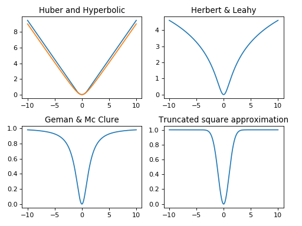

============
 Background
============

MM-Q is Python toolbox to optimise criterion or loss function like

.. math::

   J(x) = \sum_k \mu_k \Psi_k(V_k x - \omega_k)

where :math:`x` is the unknown of size :math:`N`, :math:`V_k` a matrix or linear
operator of size :math:`M_k \times N`, :math:`\omega_k` a data fixed vector of
size :math:`M_k`, :math:`\mu_k` a scalar hyperparameter, and :math:`\Psi_k(u) =
\sum_i \phi_k(u_i)`. MM-Q suppose that the scalar functions :math:`\phi` are
differentiable, even, coercive, :math:`\phi(\sqrt{\cdot})` concave, and :math:`0
< \dot{\phi}(u) / u < +\infty`.

The optimization is done thanks to quadratic surrogate function. In particular,
**no linesearch** is necessary and **close form formula for the step** are used
with guaranteed convergence. The explicit step formula allows fast convergence
of the algorithm to a minimiser of the criterion without tuning parameters. On
the contrary, the criterion must meet the conditions above.

The potential implemented in the toolbox, in addition to the square function,
are illustrated below. The Geman & Mc Clure and the truncated square
approximation are not coercive.

..
    .. plot::
       :align: center

       import numpy as np
       import matplotlib.pyplot as plt

       from qmm import qmm

       u = np.linspace(-10, 10, 1000)

       plt.figure(1)
       plt.clf()
       plt.subplot(2, 2, 1)
       plt.plot(u, qmm.Square()(u))
       plt.title('Square')
       plt.subplot(2, 2, 2)
       plt.plot(u, qmm.Huber(1)(u))
       plt.plot(u, qmm.Hyperbolic(1)(u))
       plt.title('Huber and Hyperbolic')
       plt.subplot(2, 2, 3)
       plt.plot(u, qmm.HebertLeahy(1)(u))
       plt.title('Hebert & Leahy')
       plt.subplot(2, 2, 4)
       plt.plot(u, qmm.GemanMcClure(1)(u))
       plt.plot(u, qmm.TruncSquareApprox(1)(u))
       plt.title('Geman & Mc Clure and\nTruncated square approx.')

       plt.tight_layout()

Example
=======

A classical example is the resolution of an inverse problem with the
minimization of

.. math::
   J(x) = \|y - H x\|_2^2 + \mu \Psi(V x)

where :math:`H` is a low-pass forward model, :math:`V` a regularization operator
that approximate object gradient (kind of high-pass filter) and :math:`\Psi` an
edge preserving function like Huber. The above criterion is obtained with
:math:`k \in \{1, 2\}`, :math:`\Psi_1(\cdot) = \|\cdot\|_2^2`, :math:`V_1 = H`,
:math:`\omega_1 = y`, and :math:`\omega_2 = 0`.

References
==========

The toolbox is funded on following papers. The papers [a]_, [b]_, and [c]_ are
historical foundations. The implemented algorithms in the toolbox come from [d]_
and [e]_. If you use this toolbox please cite these two papers and this toolbox
as

::

    @software{qmm,
       title = {Q-MM: The Quadratic Majorize-Minimize Python toolbox},
       author = {Orieux, Fran\c{c}ois},
       url = {https://github.com/forieux/qmm},
    }

.. [a] D. Geman and G. Reynolds, “Constrained restoration and the recovery of
       discontinuities,” IEEE Trans. Pattern Anal. Machine Intell., vol. 14, no.
       3, pp. 367–383, Mar. 1992, doi: 10.1109/34.120331.

.. [b] D. Geman and C. Yang, “Nonlinear image recovery with half-quadratic
   regularization,” IEEE Trans. on Image Process., vol. 4, no. 7, pp. 932–946,
   Jul. 1995, doi: 10.1109/83.392335.

.. [c] M. Allain, J. Idier, and Y. Goussard, “On Global and Local Convergence of
   Half-Quadratic Algorithms,” IEEE Trans. on Image Processing, vol. 15, no.
   5, p. 13, 2006.

.. [d] C. Labat and J. Idier, “Convergence of Conjugate Gradient Methods with a
   Closed-Form Stepsize Formula,” J Optim Theory Appl, p. 18, 2008.

.. [e] E. Chouzenoux, J. Idier, and S. Moussaoui, “A Majorize-Minimize Strategy
   for Subspace Optimization Applied to Image Restoration,” IEEE Trans. on Image
   Process., vol. 20, no. 6, pp. 1517–1528, Jun. 2011, doi:
   10.1109/TIP.2010.2103083.
